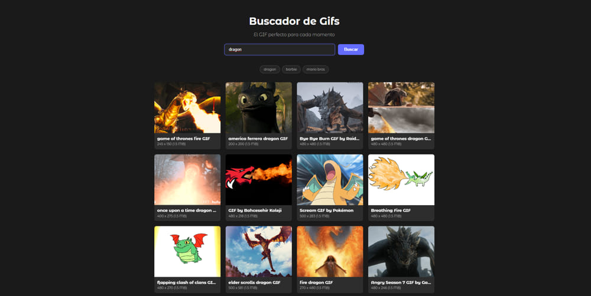

# Giphy Explorer - React 🚀

Un buscador de GIFs interactivo desarrollado con **React**, conectado directamente a la API de Giphy. Este proyecto forma parte del curso de Fernando Herrera ("React: De cero a experto"), pero ha sido personalizado de manera independiente para aplicar estilos distintos.

El propósito principal de este desarrollo es consolidar los fundamentos críticos de React (estado local, flujo de datos unidireccional y efectos) con un criterio profesional.

---

## ✨ Características y Toque Personal
*   **Interfaz Personalizada:** Rediseño completo hacia una interfaz *Dark Mode* minimalista y pulida, saliendo del esquema básico del curso para lograr una estética visual premium.
*   **Búsqueda en Tiempo Real:** Gestión limpia de formularios y peticiones HTTP asíncronas para traer resultados instantáneos.
*   **Diseño Responsivo:** Rejilla (*Grid*) optimizada para mostrar tarjetas con la información del GIF (título, dimensiones y peso) de forma fluida en diferentes resoluciones.
*   **Validación de Duplicados:** Lógica implementada para evitar la repetición de categorías ya buscadas.

---

## 🛠️ Stack Tecnológico & Conceptos Aplicados
*   **Core:** React 19+ (Functional Components)
*   **Build Tool:** Vite
*   **Estilos:** CSS3 nativo (Custom Properties y Grid)
*   **Conceptos clave:** `useState`, `useEffect`, desacoplamiento de componentes (*props*), manejo del DOM a través de eventos, e integración asíncrona de APIs de terceros (Fetch API).

---

## 📸 Vista Previa del Proyecto

A continuación se muestra el diseño final con la personalización oscura aplicada utilizando la imagen de referencia `public/desktop.jpg`:



---

## 🚀 Instalación y Uso Local

Para clonar y ejecutar este proyecto de forma local, sigue estos pasos:

1. **Clonar el repositorio:**
   ```bash
   git clone https://github.com/dmoran27/giphy-explorer-react
   ```

2. **Instalar dependencias:**
   ```bash
   npm install
   ```

3. **Configurar las variables de entorno:**
   Crea un archivo `.env` en la raíz del proyecto y agrega tu API Key de Giphy:
   ```env
   VITE_GIPHY_KEY=tu_api_key_aqui
   ```

4. **Iniciar el servidor de desarrollo:**
   ```bash
   npm run dev
   ```